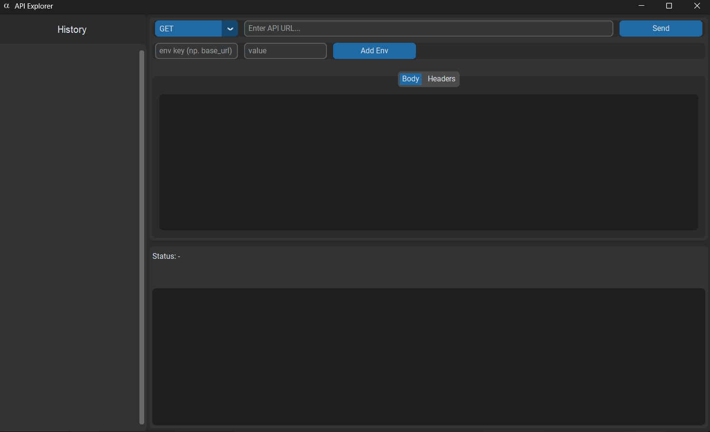
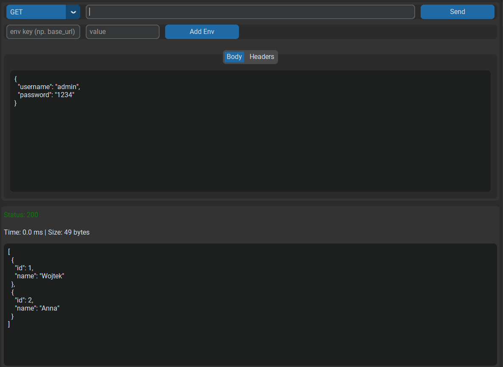
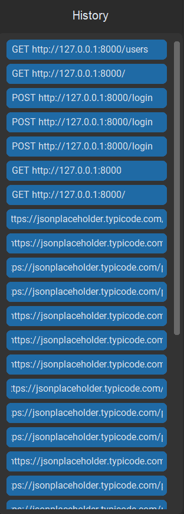

# API Explorer

API Explorer is a desktop application built with Python and CustomTkinter for testing and interacting with APIs.

It allows sending HTTP requests, viewing responses, and working with API endpoints in a simple graphical interface.

---

## Features

- Send HTTP requests (GET, POST, PUT, DELETE)
- Add custom headers
- Send JSON body
- View response (status, time, size)
- Pretty JSON display
- Request history (auto-saved)
- Environment variables (e.g. {{base_url}})
- Simple and clean UI

---

## How it works

The application sends a request to a given URL and displays the response returned by the server.

Example:
- You send a request to an endpoint (e.g. /users)
- The server returns data (JSON)
- The app displays that response

---

## How to run

Install dependencies:

pip install -r requirements.txt

Run the app:

python -m app.main

---

## Build EXE

pyinstaller --onefile --noconsole --icon=api.ico --add-data "app;app" --hidden-import=customtkinter --hidden-import=requests app/main.py

If build fails, use stable version:

pyinstaller app/main.py --onedir --noconsole --icon=api.ico

---

## Project structure

API-Explorer/
│
├── app/
├── data/
├── screenshots/
├── api.ico
├── requirements.txt
├── README.md

---

## Screenshots

### Main View

### Post-Request

### History

---

## Use case

This tool is useful for testing APIs without building a frontend.

Typical usage:
- Checking if an endpoint works
- Sending test data (e.g. login request)
- Debugging API responses

---

## Tech stack

- Python
- CustomTkinter
- Requests
- FastAPI (for testing)